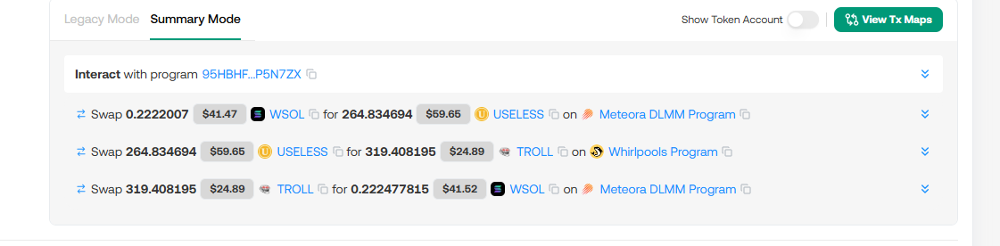
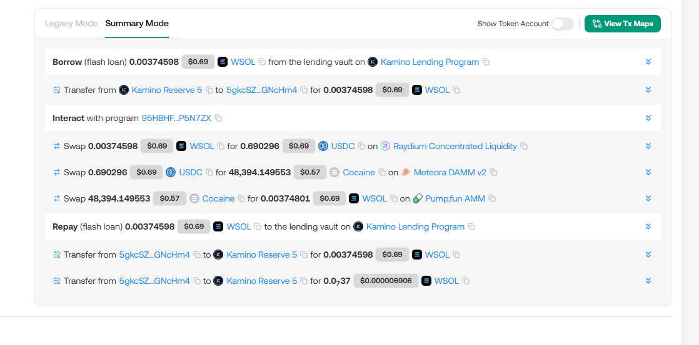

# Solarb Bot - Solana Arbitrage Trading Bot

A real-time arbitrage trading bot built in Rust for the Solana blockchain. The bot monitors multiple DEXs (Decentralized Exchanges) simultaneously, identifies profitable arbitrage opportunities, and executes trades automatically.

## Installation

### 1. Clone the repository

```bash
git clone git@github.com:thanhan7914/solarb-bot.git
cd solarb-bot
```

### 2. Build the project

```bash
cargo build --release
```

For devnet testing:

```bash
cargo build --release --features devnet
```

### 3. Configure the bot

Copy the example configuration file:

```bash
cp config.toml.example config.toml
```

Edit `config.toml` with your settings:

```toml
[rpc]
url = "https://your-rpc-endpoint.com"
websocket_url = "wss://your-websocket-endpoint.com"

[grpc]
url = "https://solana-yellowstone-grpc.publicnode.com"
token = "your-token-if-needed"
enabled = true

[bot]
mint = "So11111111111111111111111111111111111111112"  # WSOL
minimum_profit = 100_000  # Minimum profit in lamports
optimization_method = "ternary"  # ternary, golden_section, or brent_method
price_threshold = 0.001  # Price difference threshold (1 = 100%)
max_hops = 3  # Maximum route hops
optimization_amount_percent = 100  # Percentage of base amount to optimize
routes_batch_size = 40  # Number of routes to process in parallel
enabled_slippage = false  # Enable slippage protection
slippage_bps = 0  # Slippage in basis points (100 = 1%)

[watcher]
only_succeed = false  # Only watch successful transactions
only_failed = false   # Only watch failed transactions
max_pools = 100       # Maximum pools to monitor
max_routes = 100_000  # Maximum routes to generate
```

### 4. Setup wallet

Place your Solana wallet JSON file in the project root as `wallet.json`:

```bash
# Your wallet.json should be in the root directory
ls wallet.json
```

**⚠️ Security Warning**: Never commit `wallet.json` to version control. Ensure it's in `.gitignore`.

## Usage

### Running the bot

```bash
cargo run --release
```

### Docker Deployment

Build and run using Docker:

```bash
docker-compose up --build
```

Or build manually:

```bash
docker build -t solarb-bot .
docker run -v $(pwd)/config.toml:/app/config.toml -v $(pwd)/wallet.json:/app/wallet.json solarb-bot
```


## Architecture

```
┌─────────────────┐
│  gRPC Stream   │ → Real-time pool state updates
└────────┬────────┘
         │
    ┌────▼─────┐
    │  Parser  │ → Parse pool data & price updates
    └────┬─────┘
         │
    ┌────▼──────────┐
    │ Pool Indexer │ → Maintain pool registry
    └────┬──────────┘
         │
    ┌────▼───────────┐
    │ Route Finder   │ → Discover profitable routes
    └────┬───────────┘
         │
    ┌────▼───────────┐
    │ Optimizer      │ → Find optimal swap amounts
    └────┬───────────┘
         │
    ┌────▼───────────┐
    │ Transaction    │ → Execute arbitrage trades
    │   Sender       │
    └────────────────┘
```

## Project Structure

```
solarb-bot/
├── src/
│   ├── arb/              # Arbitrage logic
│   │   ├── processor.rs  # Route finding and processing
│   │   ├── sender.rs     # Transaction execution
│   │   ├── swap_math.rs  # Swap calculations
│   │   ├── optimization/ # Optimization algorithms
│   │   └── route.rs      # Route data structures
│   ├── dex/              # DEX integrations
│   │   ├── raydium/      # Raydium implementation
│   │   ├── meteora/      # Meteora DLMM implementation
│   │   ├── whirlpool/    # Whirlpool implementation
│   │   ├── pumpfun/      # PumpFun implementation
│   │   ├── solfi/        # Solfi implementation
│   │   └── vertigo/      # Vertigo implementation
│   ├── streaming/        # Real-time data streaming
│   │   ├── grpc.rs       # gRPC client
│   │   ├── parser.rs     # Data parsing
│   │   └── processor.rs  # Stream processing
│   ├── watcher/          # Transaction monitoring
│   ├── instructions/     # Solana instruction builders
│   ├── config.rs         # Configuration management
│   ├── global.rs         # Global state
│   └── main.rs           # Entry point
├── config.toml           # Configuration file
├── wallet.json           # Solana wallet (not in repo)
├── Cargo.toml            # Rust dependencies
└── README.md             # This file
```
## Example Transactions

Here are some example transactions demonstrating the bot in action:






## Disclaimer

Trading cryptocurrency involves substantial risk. Use at your own risk. The authors are not responsible for any losses incurred while using this bot.
